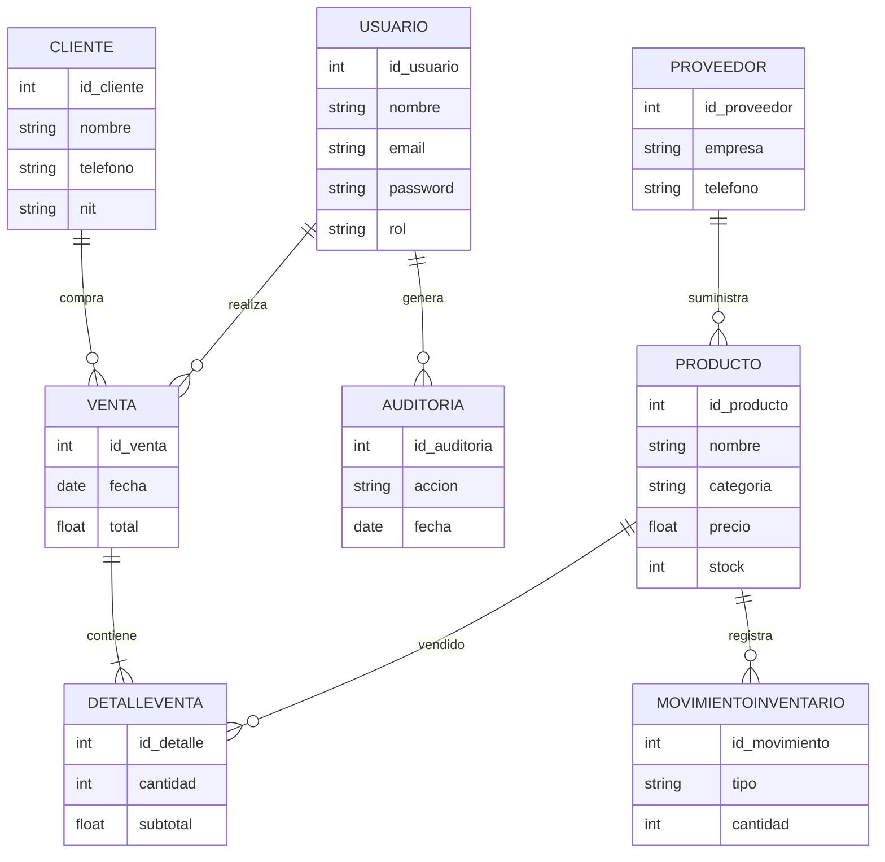
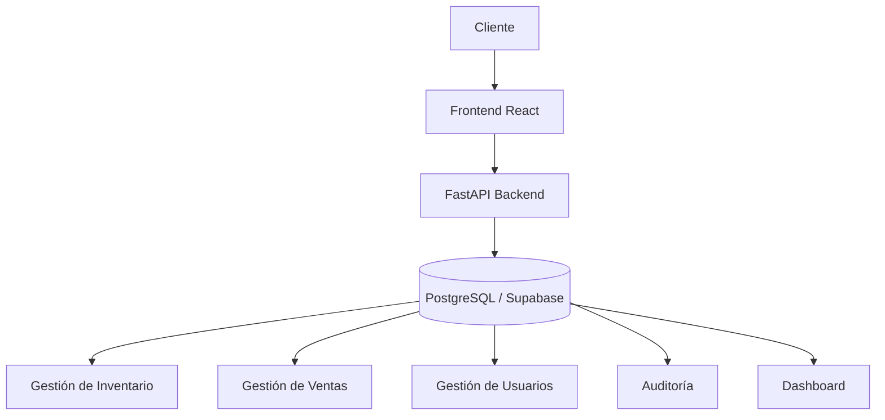

Entrega del Sprint 2 – Gestión de Productos/Servicios
----------
Universitario (a):

<p>1.-Coraite Yanaje Luz Clara<p>

<p>2.-Muraña Pizarro Nayda Thatiana<p>

<p>3.-Onofre  Alanoca Roy<p>

Carrera: Ing. de Sistemas. 
Materia: SIS324 – INGINIERIA DE SOFWARE
<p>Grupo: 17<p>
<p>Fecha: 22/05/2026<p>

   <<<<<<< HEAD
# AutoSwap – Marketplace de Autos Usados (Bolivia)

## 📦 Repositorio
Este repocitorio contiene **tres entornos** que componen la plataforma completa:

- **Backend (NestJS Gateway)** – API que gestiona usuarios, listings, escrow, pagos (Mercado Pago sandbox) y KYC.
- **Web (Next.js 14 – App Router)** – Frontend para compradores y vendedores.
- **Mobile (Expo / React Native)** – Aplicación móvil con los mismos flujos.

> **Todas las instrucciones fueron validadas y compilan sin errores (PASS).**

---TempPass123!

## 🚀 Levantar los entornos localmente
> **Requisitos previos**
> - Node ≥ 20 (LTS)
> - npm (v10) o yarn
> - **Supabase** (puedes usar un proyecto gratuito) – crea una base y habilita Storage.
> - **Mercado Pago sandbox** – genera `TEST_PUBLIC_KEY` y `TEST_ACCESS_TOKEN`.

1. **Clonar y preparar variables de entorno**
   ```bash
   git clone <repo‑url>
   cd TechStore-Manager-   # raíz del proyecto
   cp .env.example .env   # y edita los valores
   ```
   Archivo `.env` debe contener (ejemplo):
   ```env
   SUPABASE_URL=https://<your‑project>.supabase.co
   SUPABASE_ANON_KEY=xxxxxxxxxxxxxx
   TEST_MERCADO_PAGO_PUBLIC_KEY=TEST‑PUBLIC‑KEY
   TEST_MERCADO_PAGO_ACCESS_TOKEN=TEST‑ACCESS‑TOKEN
   PORT=3000            # backend
   SUPABASE_PORT=8004   # supabase local (si lo ejecutas con Docker)
   ```

2. **Backend (NestJS Gateway)**
   ```bash
   cd backend
   npm install
   npm run start:dev   # http://localhost:3000
   ```
   El servidor arrancará con los módulos AutoSwap (users, listings, escrow, payments, kyc, inspections).

3. **Web (Next.js)**
   ```bash
   cd autoswap-web
   npm install
   npm run dev          # http://localhost:3000 (proxy al gateway) o http://localhost:3001
   ```
   La aplicación está configurada con **SSR/ISR** para SEO y usa el gateway en `http://localhost:3000`.

4. **Mobile (Expo)**
   ```bash
   cd autoswap-mobile
   npm install
   npx expo start       # abre Metro y QR para tu dispositivo/emulador
   ```
   En la app, el **login** utiliza Supabase Auth; después de iniciar sesión verás las secciones *Publicar*, *Buscar* y, si tu usuario tiene rol `inspector` o `admin`, la pestaña **Inspección**.

---

## 🧪 Guía de prueba funcional (flujo completo)
### 1️⃣ Registro y publicación de un auto (vendedor)
1. En la web o móvil, registra un nuevo usuario (email + contraseña).
2. Accede a la sección **Publicar** (wizard de 5 pasos).
3. Completa los pasos 1‑3 con datos reales. **En el paso 3** introduce un precio **≥ 140 000 Bs**.
4. En el paso 4, el switch de “Solicitud de inspección” aparecerá **activado y deshabilitado** (obligatorio).
5. Finaliza el wizard (step 5). Debería enviarse una petición `POST /v1/listings` al gateway y crear el anuncio.
6. Verifica en Supabase (`listings` table) que el registro tenga `inspectionRequested = true` y `priceBs` correcto.

### 2️⃣ Aprobar la inspección (inspector)
1. En el backend, asigna el rol `inspector` a otro usuario (puedes hacerlo directamente en Supabase > `auth.users` y añadir la columna `role`).
2. Inicia sesión con ese usuario en la **app móvil**.
3. En la pestaña **Inspección** verás el listado de vehículos con inspección obligatoria (precio ≥ 140 000 Bs). Selecciona el anuncio creado.
4. En la pantalla de detalle, escribe un comentario y pulsa **Aprobar**.
5. El estado `inspectionStatus` en la tabla `vehicles` cambiará a `approved`.

### 3️⃣ Simular pago (comprador)
1. Inicia sesión con otro usuario (comprador) y abre la página del anuncio (web → `/transactions/[id]`).
2. En la sección **Checkout**, confirma el precio y pulsa **Pagar con Mercado Pago**.
3. Se abrirá el checkout sandbox de Mercado Pago (usando la `preferenceId` generada por el backend). Completa el flujo con una tarjeta de prueba.
4. Al regresar a la página, el query‑param `status=success` marcará la transacción como **pagada** y el escrow pasará a `released`.
5. Verifica en Supabase que la columna `transaction_status` sea `released`.

---

## 📚 Notas importantes
- **Persistencia**: Tanto el web como el móvil usan **Zustand** + **AsyncStorage** para guardar el estado del wizard entre sesiones.
- **Supabase Realtime** mantiene la UI actualizada cuando el webhook de Mercado Pago modifica el estado de la transacción.
- Los **scripts de seed** y migraciones de TechStore fueron eliminados; la base inicial de AutoSwap se crea con los scripts `seed-autoswap.ts` (no incluido aquí) si lo necesitas.

---

## 🎉 ¡Listo!
Con estos pasos puedes levantar todo el stack y ejecutar el flujo completo de publicación, inspección y pago en local. Cualquier duda, comenta en el repo o abre un *issue*.

---

*Este README fue generado automáticamente tras la purga completa del código legado de TechStore y la consolidación de AutoSwap.*
=======
# 🚀 PROYECTO DE INGENIERÍA DE SOFTWARE – SIS324
# 💻 TechStore Manager
### Sistema de Gestión Integral para Tiendas de Tecnología

---

# 📌 Información General

| Campo | Información |
|---|---|
| **Carrera** | Ingeniería de Sistemas |
| **Materia** | SIS324 – Ingeniería de Software |
| **Grupo** | 17 |
| **Proyecto** | TechStore Manager |
| **Tipo de Sistema** | Aplicación Web Empresarial |
| **Arquitectura** | Cliente - Servidor |
| **Base de Datos** | PostgreSQL + Supabase |

---

# 👨‍💻 Integrantes del Equipo

| Integrante | Rol |
|---|---|
| **Coraite Yanaje Luz Clara** | Frontend Developer |
| **Muraña Pizarro Nayda Thatiana** | Database & QA |
| **Onofre Alanoca Roy** | Backend & Arquitectura |

---

# 🧠 Descripción del Proyecto

**TechStore Manager** es un sistema web empresarial desarrollado para optimizar la administración de tiendas tecnológicas.

La plataforma permite gestionar:

- 📦 Inventarios
- 🛒 Ventas
- 👥 Clientes
- 🔐 Usuarios
- 📊 Reportes
- 📈 Métricas de negocio
- 🧾 Facturación
- 🔍 Auditoría de acciones

El sistema fue diseñado utilizando tecnologías modernas y una arquitectura escalable enfocada en rendimiento, seguridad y experiencia de usuario.

---

# 🎯 Objetivos del Proyecto

## Objetivo General

Desarrollar un sistema integral para automatizar y optimizar los procesos administrativos y comerciales de tiendas tecnológicas.

## Objetivos Específicos

- Automatizar el control de inventario
- Mejorar la velocidad de atención
- Reducir errores manuales
- Centralizar información
- Generar reportes inteligentes
- Implementar seguridad avanzada
- Visualizar métricas en tiempo real

---

# 🏗️ Tecnologías Utilizadas

# 🔵 Frontend

| Tecnología | Uso |
|---|---|
| React 19 | Interfaces dinámicas |
| TypeScript | Tipado seguro |
| Vite | Compilación rápida |
| Tailwind CSS | Diseño moderno |
| Lucide React | Iconografía |
| Recharts | Gráficos y métricas |

---

# 🟣 Backend

| Tecnología | Uso |
|---|---|
| Python 3.x | Lógica del servidor |
| FastAPI | API REST |
| SQLAlchemy | ORM |
| Pydantic | Validación |
| BCrypt | Seguridad |
| ReportLab | Exportación PDF |

---

# 🟢 Base de Datos

| Tecnología | Uso |
|---|---|
| PostgreSQL | Motor relacional |
| Supabase | Infraestructura cloud |

---

# ⚙️ Arquitectura del Sistema

## 📊 Modelo Relacional Principal



---

# 🧩 Módulos Principales

# 👤 Gestión de Usuarios

- CRUD completo
- Roles y permisos
- Protección de integridad
- Autenticación segura

---

# 📦 Gestión de Productos

- Registro de productos
- Control de stock
- Categorías
- Garantías

---

# 🛒 Punto de Venta (POS)

- Registro rápido de ventas
- Actualización automática de inventario
- Facturación
- Descuentos

---

# 📈 Dashboard Inteligente

- Ventas diarias
- Productos más vendidos
- Métricas financieras
- Alertas de stock

---

# 🔐 Auditoría y Seguridad

- Registro histórico
- Control de accesos
- Logs de acciones críticas

---

# 📉 Estadísticas del Sistema

## Ventas Mensuales

```text
Enero      ███████████ 45%
Febrero    ███████████████ 60%
Marzo      ███████████████████ 78%
Abril      ███████████████████████ 92%
Mayo       █████████████████████████ 100%
```

---

# 📊 Comparativa del Sistema

| Característica | Sistema Tradicional | TechStore Manager |
|---|---|---|
| Control Manual | ❌ | ✅ |
| Reportes Automáticos | ❌ | ✅ |
| Seguridad | Baja | Alta |
| Escalabilidad | Baja | Alta |
| Dashboard | ❌ | ✅ |
| Auditoría | ❌ | ✅ |

---

# 🔒 Seguridad Implementada

✅ Encriptación BCrypt  
✅ Validación con Pydantic  
✅ Integridad Relacional  
✅ Protección de usuarios  
✅ Auditoría avanzada  

---

# 🚀 Instalación del Proyecto

# 📋 Requisitos Previos

```bash
Node.js v18+
Python 3.10+
PostgreSQL
Cuenta Supabase
```

---

# ⚙️ Configuración del Backend

```bash
cd backend

pip install -r requirements.txt

python main.py
```

---

# 💻 Configuración del Frontend

```bash
npm install

npm run dev
```

---

# ▶️ Inicio Automático

```bash
Iniciar_TechStore.bat
```

Este archivo inicia automáticamente:

- Backend
- Frontend
- Servicios principales

---

# 📂 Estructura del Proyecto

```text
TechStore-Manager/
│
├── backend/
│   ├── models/
│   ├── routes/
│   ├── database/
│   └── main.py
│
├── src/
│   ├── screens/
│   ├── components/
│   ├── services/
│   └── api.ts
│
├── public/
│
└── Iniciar_TechStore.bat
```

---

# 📊 Flujo General del Sistema



---

# 📌 Metodología de Desarrollo

## 🔄 Metodología Ágil

El sistema fue desarrollado aplicando:

- Desarrollo incremental
- Arquitectura modular
- Iteraciones ágiles
- Testing continuo
- Buenas prácticas

---

# 🧪 Buenas Prácticas Implementadas

✅ Arquitectura escalable  
✅ Código modular  
✅ Componentización React  
✅ API REST estructurada  
✅ Seguridad avanzada  
✅ ORM relacional  

---

# 📈 Beneficios del Sistema

| Beneficio | Resultado |
|---|---|
| Automatización | Reduce errores |
| Dashboard | Mejora decisiones |
| Seguridad | Protege datos |
| Inventario | Mayor control |
| Escalabilidad | Crecimiento empresarial |

---

# 🔮 Futuras Mejoras

- 📱 Aplicación móvil
- 💳 Pagos QR
- 🤖 Inteligencia Artificial
- ☁️ Microservicios
- 📡 Notificaciones en tiempo real
- 📈 Business Intelligence

---

# 🏁 Conclusiones

TechStore Manager es una solución moderna y escalable orientada a mejorar la administración de tiendas tecnológicas.

El proyecto integra herramientas empresariales actuales bajo una arquitectura robusta y segura, permitiendo optimizar procesos operativos y mejorar la toma de decisiones mediante visualización inteligente de datos.

Además, permitió aplicar conocimientos de:

- Ingeniería de Software
- Arquitectura Web
- Desarrollo Full Stack
- Bases de Datos
- Seguridad Informática
- Sistemas Empresariales

---

# 📚 Proyecto Académico

Proyecto desarrollado para la materia:

# SIS324 – Ingeniería de Software

Aplicando:

- Arquitectura moderna
- Buenas prácticas
- Patrones de diseño
- Desarrollo ágil
- Sistemas empresariales reales

---

# ⭐ TechStore Manager
## “Tecnología, Control y Gestión Inteligente”
>>>>>>> 6d2ac4a57ef6ec72ccaa4a9f828eaabc76fcaa45
